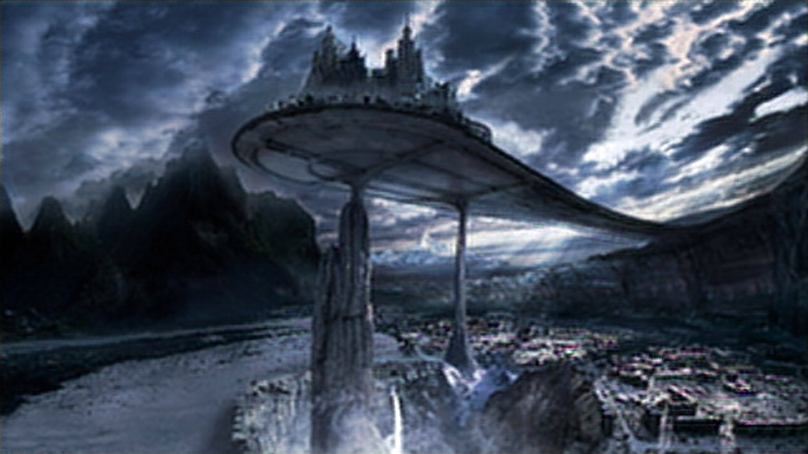

# Background and Motivation

Live video and Image streaming requires good Internet speed, thus if we have a low connection speed it is not possible to stream properly. Altough I don't have much knowledge of Computer Vision. but I just tought if I can build a NN that can compress the image into latent space and then back reconstruct it to original form. But by doing so we also lose some features and image details depending on the compression. So then I decided to implement it trough Keras.

# Architecture

The architecture for the encoder and decoder CNN is simple, and not much complex. Altough I have to make the CNN such that Raspberry PI 3 Model B+ can run it.

## Encoder Model
Layer (type)                 Output Shape              Param #
=================================================================
input_1 (InputLayer)         (None, 360, 640, 3)       0
_________________________________________________________________
conv2d_1 (Conv2D)            (None, 360, 640, 8)       224
_________________________________________________________________
activation_1 (Activation)    (None, 360, 640, 8)       0
_________________________________________________________________
average_pooling2d_1 (Average (None, 180, 320, 8)       0
_________________________________________________________________
conv2d_2 (Conv2D)            (None, 180, 320, 16)      1168
_________________________________________________________________
activation_2 (Activation)    (None, 180, 320, 16)      0
_________________________________________________________________
average_pooling2d_2 (Average (None, 90, 160, 16)       0
_________________________________________________________________
conv2d_3 (Conv2D)            (None, 90, 160, 16)       2320
_________________________________________________________________
activation_3 (Activation)    (None, 90, 160, 16)       0
_________________________________________________________________
average_pooling2d_3 (Average (None, 45, 80, 16)        0
_________________________________________________________________
flatten_1 (Flatten)          (None, 57600)             0
=================================================================
    
## Decoder Model
 _________________________________________________________________
Layer (type)                 Output Shape              Param #
=================================================================
input_2 (InputLayer)         (None, 57600)             0
_________________________________________________________________
reshape_1 (Reshape)          (None, 45, 80, 16)        0
_________________________________________________________________
conv2d_transpose_1 (Conv2DTr (None, 90, 160, 128)      18560
_________________________________________________________________
activation_4 (Activation)    (None, 90, 160, 128)      0
_________________________________________________________________
conv2d_transpose_2 (Conv2DTr (None, 180, 320, 64)      73792
_________________________________________________________________
activation_5 (Activation)    (None, 180, 320, 64)      0
_________________________________________________________________
conv2d_transpose_3 (Conv2DTr (None, 360, 640, 32)      18464
_________________________________________________________________
conv2d_transpose_4 (Conv2DTr (None, 360, 640, 3)       99
=================================================================
    

# Samples

    

        <h2>Original Image</h2>        
        
    

    

        <h2>ReconstructedImage</h2>
        
    

